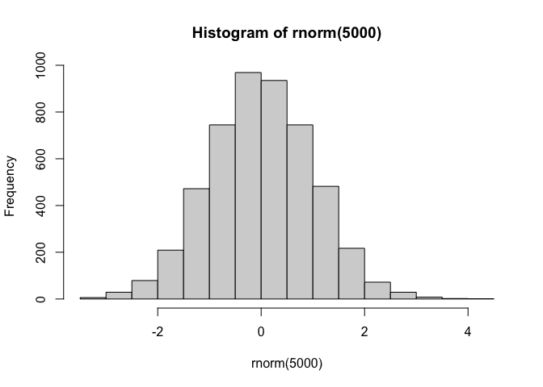
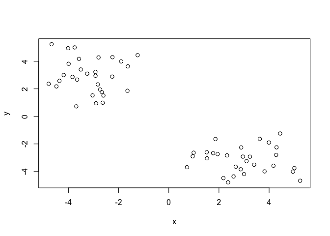
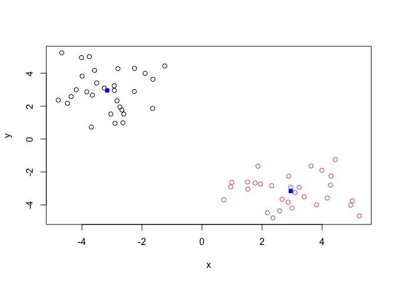
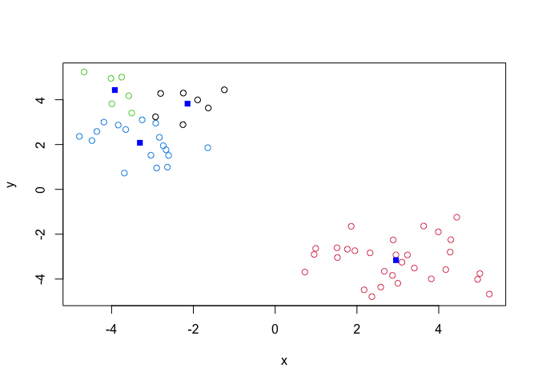
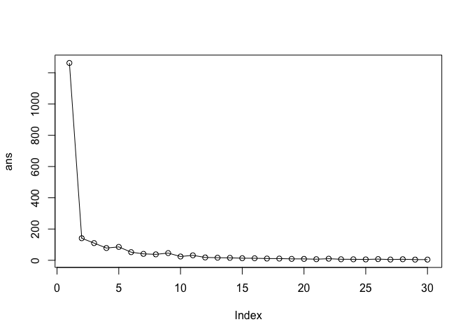
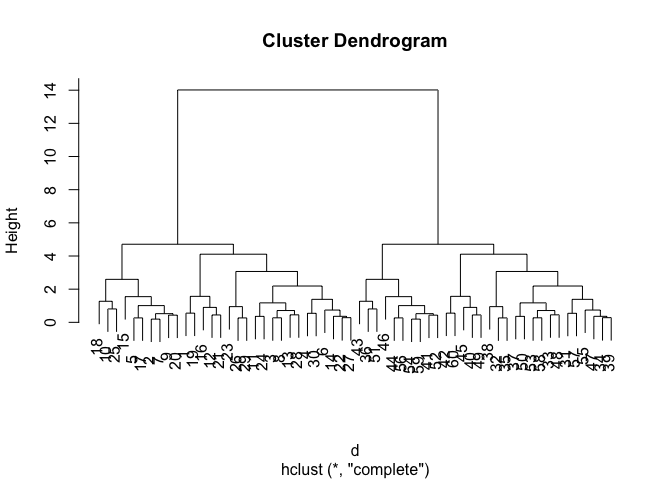
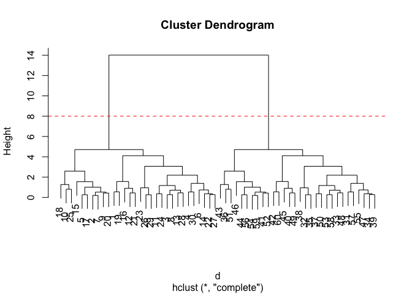
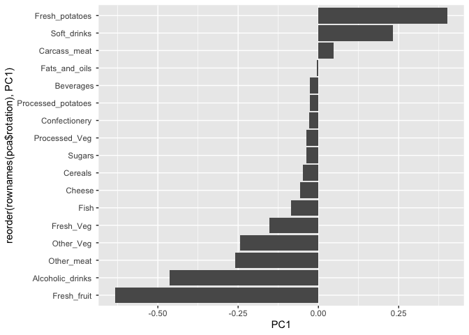

# Class 7: Machine learning 1
Allyson Cauffiel PID: A19113278

- [Background](#background)
- [K-means clustering](#k-means-clustering)
- [Hierarchical Clustering](#hierarchical-clustering)
- [PCA of UK food data](#pca-of-uk-food-data)
  - [Spottinhg major differences and
    trends](#spottinhg-major-differences-and-trends)
  - [Pairs plots and Heatmaps](#pairs-plots-and-heatmaps)
- [PCA to the rescue!!](#pca-to-the-rescue)

## Background

Today we will begin out exploration of some important machine learning
methods, namely **clustering** and **dimensionality reduction**.

Let’s make up some input data where we know what the natural “clusters”
are.

The function `rnorm()` can be useful here

``` r
hist(rnorm(5000))
```



> Q. Generate 30 random numbers centered at +3

``` r
rnorm(30, mean = +3)
```

     [1] 2.484566 2.139004 2.619467 2.904567 4.416041 3.518741 2.030996 4.138445
     [9] 2.042178 2.296865 5.715411 3.377466 2.033635 2.590570 3.735041 3.714133
    [17] 2.525705 2.527940 2.399999 1.753090 4.499741 4.787092 4.975869 3.870238
    [25] 3.747329 2.716816 4.940124 3.109463 2.270492 1.872485

> Q. generate 30 random numbers centered at -3

``` r
rnorm(30, mean = -3)
```

     [1] -3.2070115 -2.4995820 -3.3522734 -3.1793318 -2.1723643 -2.5909388
     [7] -3.8578548 -3.0990801 -3.9408614 -1.3598369 -0.6193299 -1.9593435
    [13] -3.2657931 -1.3319718 -1.9113805 -4.3923895 -3.8551334 -2.7313273
    [19] -2.8957247 -2.6702195 -2.0411376 -3.9532798 -3.9247892 -2.2186684
    [25] -2.2516472 -3.9753176 -4.3295379 -1.4602242 -2.4198490 -2.6726434

> Combined

``` r
tmp <- c(rnorm(30, mean = + 3),
         rnorm(30, mean = - 3))
x <- cbind(x = tmp, y = rev(tmp))
plot(x)
```



## K-means clustering

The main function in “base R” for K-means clustering is called
`k-means()`:

``` r
km <- kmeans(x, centers = 2)
km
```

    K-means clustering with 2 clusters of sizes 30, 30

    Cluster means:
              x         y
    1 -3.158365  2.955617
    2  2.955617 -3.158365

    Clustering vector:
     [1] 2 2 2 2 2 2 2 2 2 2 2 2 2 2 2 2 2 2 2 2 2 2 2 2 2 2 2 2 2 2 1 1 1 1 1 1 1 1
    [39] 1 1 1 1 1 1 1 1 1 1 1 1 1 1 1 1 1 1 1 1 1 1

    Within cluster sum of squares by cluster:
    [1] 70.61701 70.61701
     (between_SS / total_SS =  88.8 %)

    Available components:

    [1] "cluster"      "centers"      "totss"        "withinss"     "tot.withinss"
    [6] "betweenss"    "size"         "iter"         "ifault"      

> Q. What component of the results object details the cluster size?

``` r
km$size
```

    [1] 30 30

> Q. What component of the results object details the cluster centers?

``` r
km$centers
```

              x         y
    1 -3.158365  2.955617
    2  2.955617 -3.158365

> Q. What component of the results object details the cluster membership
> vector (i.e. our main result of which points lie in which cluster?)

``` r
km$cluster
```

     [1] 2 2 2 2 2 2 2 2 2 2 2 2 2 2 2 2 2 2 2 2 2 2 2 2 2 2 2 2 2 2 1 1 1 1 1 1 1 1
    [39] 1 1 1 1 1 1 1 1 1 1 1 1 1 1 1 1 1 1 1 1 1 1

> Q. Plot our clustering results with points colored by cluster and also
> add the cluster centers as new points colored blue

``` r
plot(x, col = km$cluster)
points(km$centers, col = "blue", pch=15)
```



> Q. Run `kmeans()` again and this time produce 4 clusters (and call
> your result object `k4`) and make a results figure like above?

``` r
k4 <- kmeans(x, center = 4)
plot(x, col = k4$cluster)
points(k4$centers, col= "blue", pch = 15)
```



The metric

``` r
km$tot.withinss
```

    [1] 141.234

``` r
k4$tot.withinss
```

    [1] 98.71159

``` r
ans <- NULL
for(i in 1:30) {
  ans <- c(ans, kmeans(x, centers =i)$tot.withinss)
}
ans
```

     [1] 1262.657499  141.234029  109.999539   78.399553   85.638730   52.017564
     [7]   41.080418   37.964702   46.146949   24.113954   31.775017   18.175091
    [13]   16.569668   15.617479   13.412993   12.924849   11.108224   10.870014
    [19]    8.992005    8.863619    7.029493   10.109855    6.630429    6.429497
    [25]    5.630434    7.690548    4.880336    6.826615    4.463655    4.516427

``` r
plot(ans, type = "o")
```



**Key-point:** K-means is self fulfilling and will assume a cluster
structure on your data even if there is none. It will give an answer
even when it’s meaningless

## Hierarchical Clustering

The main function of hierarchical clustering is called `hclust()`.

Unlike `kmeans()` (which does all the work for you) you can’t just pass
`hclust()` our raw input data. It needs a “distance matrix” like the one
returned from the `dist()` function.

``` r
d <- dist(x)
hc <- hclust(d)
hc
```


    Call:
    hclust(d = d)

    Cluster method   : complete 
    Distance         : euclidean 
    Number of objects: 60 

``` r
plot(hc)
```



To extract our cluster membership vector from `hclust()` result object
we have to “cut” our tree at a given height to yield speparate
“groups”/“branches”/

``` r
plot(hc)
abline(h=8, col= "red", lty = 2)
```



To do this we use the `cutree()` function on our `hclust()` object:

``` r
grps <- cutree(hc, h=8)
grps
```

     [1] 1 1 1 1 1 1 1 1 1 1 1 1 1 1 1 1 1 1 1 1 1 1 1 1 1 1 1 1 1 1 2 2 2 2 2 2 2 2
    [39] 2 2 2 2 2 2 2 2 2 2 2 2 2 2 2 2 2 2 2 2 2 2

``` r
table(grps, km$cluster) 
```

        
    grps  1  2
       1  0 30
       2 30  0

## PCA of UK food data

Import the dataset of food consumption in the UK:

``` r
url <- "https://tinyurl.com/UK-foods"
x <- read.csv(url)
x
```

                         X England Wales Scotland N.Ireland
    1               Cheese     105   103      103        66
    2        Carcass_meat      245   227      242       267
    3          Other_meat      685   803      750       586
    4                 Fish     147   160      122        93
    5       Fats_and_oils      193   235      184       209
    6               Sugars     156   175      147       139
    7      Fresh_potatoes      720   874      566      1033
    8           Fresh_Veg      253   265      171       143
    9           Other_Veg      488   570      418       355
    10 Processed_potatoes      198   203      220       187
    11      Processed_Veg      360   365      337       334
    12        Fresh_fruit     1102  1137      957       674
    13            Cereals     1472  1582     1462      1494
    14           Beverages      57    73       53        47
    15        Soft_drinks     1374  1256     1572      1506
    16   Alcoholic_drinks      375   475      458       135
    17      Confectionery       54    64       62        41

> Q1. How many rows and columns are in your new data frame named x? What
> R functions could you use to answer this questions?

``` r
dim(x)
```

    [1] 17  5

One solution to set the row names to do it by hand …

``` r
rownames(x) <- x[,1]
```

To remove the first column I can use the minus index trick

***don’t do this***

``` r
#x <- x[,-1] can't do this because it will delete a column each time you run it. 
```

A better way to do this is to set the row nmae to tge first column with
`read.csv()`

``` r
x <- read.csv(url, row.name = 1)
x
```

                        England Wales Scotland N.Ireland
    Cheese                  105   103      103        66
    Carcass_meat            245   227      242       267
    Other_meat              685   803      750       586
    Fish                    147   160      122        93
    Fats_and_oils           193   235      184       209
    Sugars                  156   175      147       139
    Fresh_potatoes          720   874      566      1033
    Fresh_Veg               253   265      171       143
    Other_Veg               488   570      418       355
    Processed_potatoes      198   203      220       187
    Processed_Veg           360   365      337       334
    Fresh_fruit            1102  1137      957       674
    Cereals                1472  1582     1462      1494
    Beverages                57    73       53        47
    Soft_drinks            1374  1256     1572      1506
    Alcoholic_drinks        375   475      458       135
    Confectionery            54    64       62        41

> Q2. Which approach to solving the ‘row-names problem’ mentioned above
> do you prefer and why? Is one approach more robust than another under
> certain circumstances? - the `read.csv()` option is better so that it
> doesnt delete a column everytime i run the code

### Spottinhg major differences and trends

Is difficult even in this wee 17D dataset…

``` r
barplot(as.matrix(x), beside=T, col=rainbow(nrow(x)))
```


Even worse…

``` r
barplot(as.matrix(x), beside=F, col=rainbow(nrow(x)))
```


### Pairs plots and Heatmaps

> Q5: We can use the pairs() function to generate all pairwise plots for
> our countries. Can you make sense of the following code and resulting
> figure? What does it mean if a given point lies on the diagonal for a
> given plot?

``` r
pairs(x, col=rainbow(nrow(x)), pch=16)
```


``` r
library(pheatmap)

pheatmap( as.matrix(x) )
```


> Q6. Based on the pairs and heatmap figures, which countries cluster
> together and what does this suggest about their food consumption
> patterns? Can you easily tell what the main differences between N.
> Ireland and the other countries of the UK in terms of this data-set?

## PCA to the rescue!!

The main PCA function in “base R” is called `prcomp()`. This function
wants the transpose of our food data as input (i.e. the foods as columns
and the countries as rows).

``` r
pca <- prcomp(t(x))
```

``` r
summary(pca)
```

    Importance of components:
                                PC1      PC2      PC3     PC4
    Standard deviation     324.1502 212.7478 73.87622 2.7e-14
    Proportion of Variance   0.6744   0.2905  0.03503 0.0e+00
    Cumulative Proportion    0.6744   0.9650  1.00000 1.0e+00

``` r
attributes(pca)
```

    $names
    [1] "sdev"     "rotation" "center"   "scale"    "x"       

    $class
    [1] "prcomp"

To make one of our main PCA results figures we turn to `pca$x` the
scores along our new PCs. This is called “PC plot” or “score plot” or
“ordination plot” …

``` r
my_cols <- c("orange", "red", "blue", "darkgreen")
```

``` r
library(ggplot2)


ggplot(pca$x)+
  aes(PC1, PC2,) +
  geom_point(col = my_cols)
```


The second major result figure is called a “loadings plot” of “variable
contributions plot” or “weight plot”

``` r
ggplot(pca$rotation) +
  aes(x= PC1, y = reorder(rownames(pca$rotation), PC1)) +
  geom_col()
```


