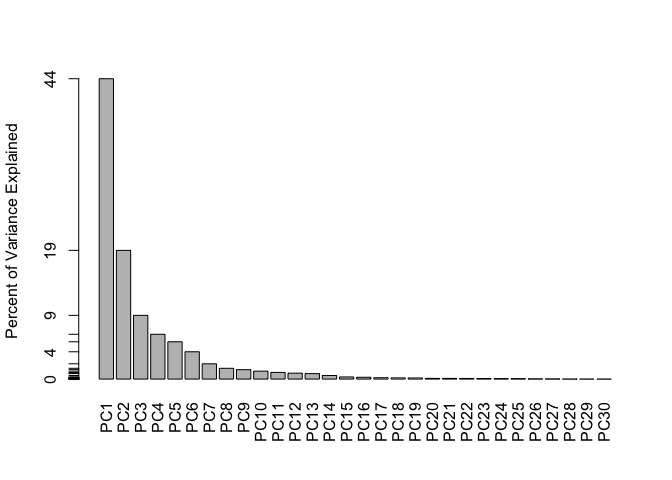
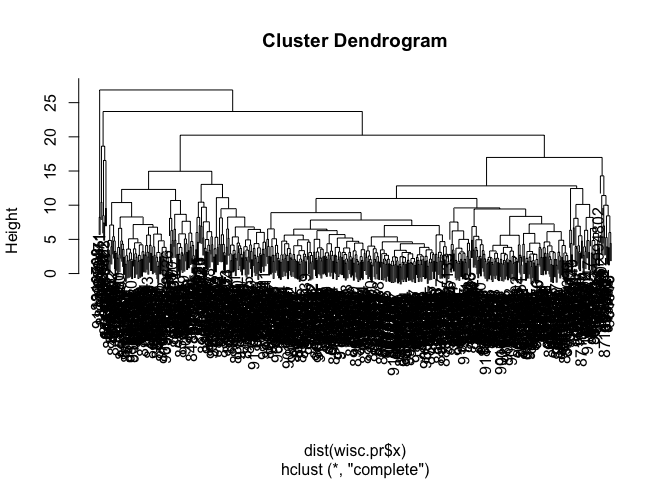
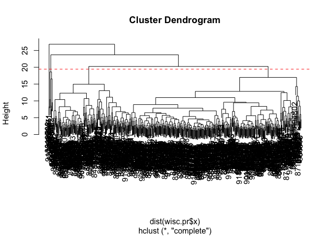

# Class 08: Breast Cancer Mini Project
Allyson Cauffiel (PID: A19113278)

- [Background](#background)
- [Data Input](#data-input)
- [Principal Component Analysis
  (PCA)](#principal-component-analysis-pca)
  - [Scree Plot](#scree-plot)
- [Interpreting PCA results](#interpreting-pca-results)
- [4. Hierarchical Clustering](#4-hierarchical-clustering)
  - [Results](#results)
  - [Combining Methods](#combining-methods)
  - [Predictions](#predictions)

## Background

In today’s class we will be employing all the R techniques for data
analysis that we have learned thus far - including the machine learning
methods of clustering and PCA - to analyze real breast cancer biopsy
data.

## Data Input

The data is in the csv format

``` r
fna.data <- "WisconsinCancer.csv"

wisc.df <- read.csv(fna.data, row.names=1)
```

> Q1. How many observations are in this dataset?

``` r
nrow(wisc.df)
```

    [1] 569

> Q2. How many of the observations have a malignant diagnosis?

``` r
length(wisc.df$diagnosis == "M")
```

    [1] 569

> Q3. How many variables/features in the data are suffixed with \_mean?

``` r
length(grep("_mean", colnames(wisc.df)))
```

    [1] 10

We need to remove the `diagnosis` column before we do any further
analysis of this dataset - we don’t want to pass this to PCA etc. We
will save it as a seperate wee vector that we can use later to compare
our findings to those of experts.

``` r
wisc.data <- wisc.df[,-1]
diagnosis <- wisc.df$diagnosis
```

## Principal Component Analysis (PCA)

The main function in base R is called `prcomp()` we will use the
optional argument `scale=TRUE` here as the data columns
/features/dimensionsare on very different scales in the original data
set.

``` r
wisc.pr <- prcomp(wisc.data, scale = TRUE)
```

``` r
attributes(wisc.pr)
```

    $names
    [1] "sdev"     "rotation" "center"   "scale"    "x"       

    $class
    [1] "prcomp"

### Scree Plot

``` r
library(ggplot2)

ggplot(wisc.pr$x) +
  aes(PC1,PC2, col = diagnosis) +
  geom_point()
```


``` r
colMeans(wisc.pr$x)
```

              PC1           PC2           PC3           PC4           PC5 
     2.811264e-15 -8.489596e-16  4.167727e-16  3.523056e-15 -1.179295e-15 
              PC6           PC7           PC8           PC9          PC10 
    -1.627677e-15  6.438903e-16  3.664321e-15  6.270126e-16 -2.888519e-15 
             PC11          PC12          PC13          PC14          PC15 
    -2.093619e-16  1.174466e-15  2.478002e-17  1.195295e-15 -1.966792e-15 
             PC16          PC17          PC18          PC19          PC20 
    -8.893491e-16  1.959085e-15 -4.193482e-15 -3.376229e-15  1.759674e-15 
             PC21          PC22          PC23          PC24          PC25 
    -6.939967e-15  1.980353e-15  1.715943e-16  1.970256e-15  1.372785e-15 
             PC26          PC27          PC28          PC29          PC30 
     2.178496e-15  1.375828e-15  1.287110e-16  1.171551e-15 -1.512990e-15 

``` r
summary(wisc.pr)
```

    Importance of components:
                              PC1    PC2     PC3     PC4     PC5     PC6     PC7
    Standard deviation     3.6444 2.3857 1.67867 1.40735 1.28403 1.09880 0.82172
    Proportion of Variance 0.4427 0.1897 0.09393 0.06602 0.05496 0.04025 0.02251
    Cumulative Proportion  0.4427 0.6324 0.72636 0.79239 0.84734 0.88759 0.91010
                               PC8    PC9    PC10   PC11    PC12    PC13    PC14
    Standard deviation     0.69037 0.6457 0.59219 0.5421 0.51104 0.49128 0.39624
    Proportion of Variance 0.01589 0.0139 0.01169 0.0098 0.00871 0.00805 0.00523
    Cumulative Proportion  0.92598 0.9399 0.95157 0.9614 0.97007 0.97812 0.98335
                              PC15    PC16    PC17    PC18    PC19    PC20   PC21
    Standard deviation     0.30681 0.28260 0.24372 0.22939 0.22244 0.17652 0.1731
    Proportion of Variance 0.00314 0.00266 0.00198 0.00175 0.00165 0.00104 0.0010
    Cumulative Proportion  0.98649 0.98915 0.99113 0.99288 0.99453 0.99557 0.9966
                              PC22    PC23   PC24    PC25    PC26    PC27    PC28
    Standard deviation     0.16565 0.15602 0.1344 0.12442 0.09043 0.08307 0.03987
    Proportion of Variance 0.00091 0.00081 0.0006 0.00052 0.00027 0.00023 0.00005
    Cumulative Proportion  0.99749 0.99830 0.9989 0.99942 0.99969 0.99992 0.99997
                              PC29    PC30
    Standard deviation     0.02736 0.01153
    Proportion of Variance 0.00002 0.00000
    Cumulative Proportion  1.00000 1.00000

``` r
pv.var <- wisc.pr$sdev^2
head(pv.var)
```

    [1] 13.281608  5.691355  2.817949  1.980640  1.648731  1.207357

``` r
pve <- pv.var/sum(pv.var)
head(pve)
```

    [1] 0.44272026 0.18971182 0.09393163 0.06602135 0.05495768 0.04024522

``` r
plot(c(1,pve), xlab = "Principal Component", 
     ylab = "Proportion of Variance Explained", 
     ylim = c(0, 1), type = "o")
```


``` r
barplot(pve, ylab = "Percent of Variance Explained",
     names.arg=paste0("PC",1:length(pve)), las=2, axes = FALSE)
axis(2, at=pve, labels=round(pve,2)*100 )
```



> Q4. From your results, what proportion of the original variance is
> captured by the first principal component (PC1)?

0.4427

> Q5. How many principal components (PCs) are required to describe at
> least 70% of the original variance in the data?

3 \> Q6. How many principal components (PCs) are required to describe at
least 90% of the original variance in the data?

7

## Interpreting PCA results

``` r
biplot(wisc.pr)
```


> Q7. What stands out to you about this plot? Is it easy or difficult to
> understand? Why?

This plot is extremely hard to interpret, it’s messy.

> Q8. Generate a similar plot for principal components 1 and 3. What do
> you notice about these plots?

It’s showing that principal component 1 is accounting for a large
portion of the variance, thus capturing the distinct clusters. PC1
captures ~ 44% while PC2 and PC3 are much lower percentages.

``` r
ggplot(wisc.pr$x) +
  aes(PC1,PC3, col = diagnosis) +
  geom_point()
```


> Q9. For the first principal component, what is the component of the
> loading vector (i.e. wisc.pr\$rotation\[,1\]) for the feature
> concave.points_mean? This tells us how much this original feature
> contributes to the first PC. Are there any features with larger
> contributions than this one?

-0.26085376, no, there are no features with larger contributions than
this one.

``` r
wisc.pr$rotation[,1]
```

                radius_mean            texture_mean          perimeter_mean 
                -0.21890244             -0.10372458             -0.22753729 
                  area_mean         smoothness_mean        compactness_mean 
                -0.22099499             -0.14258969             -0.23928535 
             concavity_mean     concave.points_mean           symmetry_mean 
                -0.25840048             -0.26085376             -0.13816696 
     fractal_dimension_mean               radius_se              texture_se 
                -0.06436335             -0.20597878             -0.01742803 
               perimeter_se                 area_se           smoothness_se 
                -0.21132592             -0.20286964             -0.01453145 
             compactness_se            concavity_se       concave.points_se 
                -0.17039345             -0.15358979             -0.18341740 
                symmetry_se    fractal_dimension_se            radius_worst 
                -0.04249842             -0.10256832             -0.22799663 
              texture_worst         perimeter_worst              area_worst 
                -0.10446933             -0.23663968             -0.22487053 
           smoothness_worst       compactness_worst         concavity_worst 
                -0.12795256             -0.21009588             -0.22876753 
       concave.points_worst          symmetry_worst fractal_dimension_worst 
                -0.25088597             -0.12290456             -0.13178394 

# 4. Hierarchical Clustering

``` r
data.dist <- hclust(dist(wisc.pr$x))
plot(data.dist)
```



## Results

``` r
plot(data.dist)


n <- length(data.dist$height)
h4 <- mean(data.dist$height[(n-3):(n-2)])

abline(h = h4, col="red", lty=2)
```



``` r
h4
```

    [1] 19.43994

``` r
n
```

    [1] 568

> Q10. Using the plot() and abline() functions, what is the height at
> which the clustering model has 4 clusters? 19.43994

> Q12. Which method gives your favorite results for the same data.dist
> dataset? Explain your reasoning.

`ward.d2` - the variance is minimized

## Combining Methods

the idea here is that i can take my ne variables (the PCs) that are
better descriptors of the data-set than the original features (i.e. the
30 columns in`wisc.data`) and use these as a basis for clustering.

``` r
pc.dist <- dist(wisc.pr$x[ ,1:3])
wisc.pr.hclust <- hclust(pc.dist, method = "ward.D2")
plot(wisc.pr.hclust)
```


> Q13. How well does the newly created hclust model with two clusters
> separate out the two “M” and “B” diagnoses?

``` r
grps <- cutree(wisc.pr.hclust, k =2)
table(grps)
```

    grps
      1   2 
    203 366 

I can now run `table()` with both my clustering `grps` and the expert
`diagnosis`.

> Q14. How well do the hierarchical clustering models you created in the
> previous sections (i.e. without first doing PCA) do in terms of
> separating the diagnoses? Again, use the table() function to compare
> the output of each model (wisc.hclust.clusters and
> wisc.pr.hclust.clusters) with the vector containing the actual
> diagnoses.

``` r
table(grps, diagnosis)
```

        diagnosis
    grps   B   M
       1  24 179
       2 333  33

Our cluster “1” has 179 “M” diagnosis Our cluster “2” has 333 “B”
diagnosis

179 TP 24 FP 333 TN 33 FN

Sensitivity: TP/(TP+FN)

``` r
179/(179+33)
```

    [1] 0.8443396

Specificity TN/(TN+FP)

``` r
333/(333+24)
```

    [1] 0.9327731

## Predictions

We will use the `predict()` function that will take our PCA model from
before and new cancer cell data and project that data onto our PCA
space.

``` r
new <- read.csv("new_samples.csv")
npc <- predict(wisc.pr, newdata = new)
npc
```

               PC1       PC2        PC3        PC4       PC5        PC6        PC7
    [1,]  2.576616 -3.135913  1.3990492 -0.7631950  2.781648 -0.8150185 -0.3959098
    [2,] -4.754928 -3.009033 -0.1660946 -0.6052952 -1.140698 -1.2189945  0.8193031
                PC8       PC9       PC10      PC11      PC12      PC13     PC14
    [1,] -0.2307350 0.1029569 -0.9272861 0.3411457  0.375921 0.1610764 1.187882
    [2,] -0.3307423 0.5281896 -0.4855301 0.7173233 -1.185917 0.5893856 0.303029
              PC15       PC16        PC17        PC18        PC19       PC20
    [1,] 0.3216974 -0.1743616 -0.07875393 -0.11207028 -0.08802955 -0.2495216
    [2,] 0.1299153  0.1448061 -0.40509706  0.06565549  0.25591230 -0.4289500
               PC21       PC22       PC23       PC24        PC25         PC26
    [1,]  0.1228233 0.09358453 0.08347651  0.1223396  0.02124121  0.078884581
    [2,] -0.1224776 0.01732146 0.06316631 -0.2338618 -0.20755948 -0.009833238
                 PC27        PC28         PC29         PC30
    [1,]  0.220199544 -0.02946023 -0.015620933  0.005269029
    [2,] -0.001134152  0.09638361  0.002795349 -0.019015820

``` r
plot(wisc.pr$x[,1:2], col=grps)
points(npc[,1], npc[,2], col = "blue", pch = 16, cex = 3)
text(npc[,1], npc[,2], c(1,2), col="white")
```


> Q.16 Which of these new patients should we prioritize for follow up
> based on your results?

Patient 2 lines up with the malignent data points. Its far enough awy
from the benign cluster that we can also assume that it’s most likely
not a false positive.
